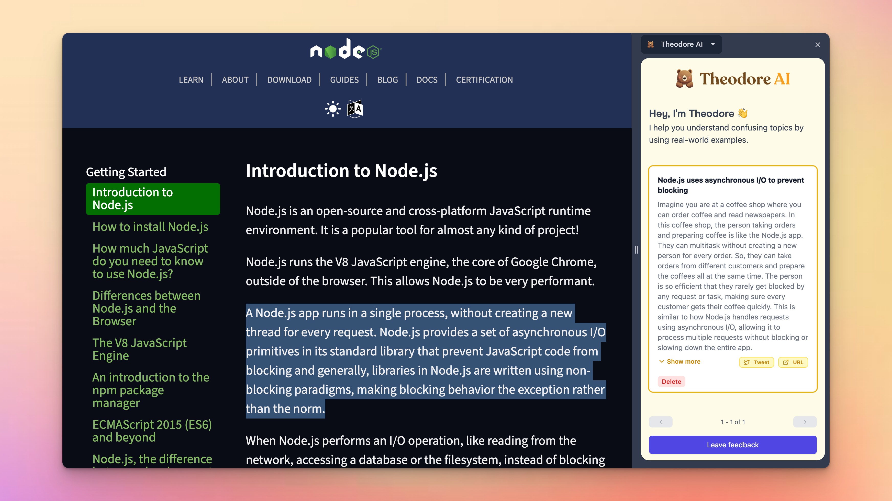

import HighlightedTitle from '../../components/HighlightedTitle';

# <HighlightedTitle text={"January 2024: Theodore AI"} size='text-3xl' />

For 2024, I'm setting out to ship 12 products over the course of the year.

This suits me well because I love to build, but get bored quickly if I don't see traction.

Up until lately, I've found it challenging as an industry software engineer to moonlight as an indie hacker, mainly because during the day, my job is to build software in a way that it will stand the test of time, is maintainable, readable, structured well. The list goes on...

My last project, [pairprogram.com](https://pairprogram.com) is a great example of this. Really well-built with a robust feature set.

But in this arena -- the indie hacking arena -- things are different. I'm not building enterprise software, so I can't get caught up on writing the most elegant, beautiful code, otherwise it will take me forever to ship and get enough feedback to validate my idea.

Or by the time I do ship, maybe I'm already so burnt out or bored with the idea that I don't continue to bring the right energy to the project.

## What I'm building for January

I decided to ship 12 projects in 12 months on January 18th, 2024. That left me with about 2 weeks to get the first project out the door.

I had been wanting to hack on a little Chrome extension for some time now, so I built a small project just to get some reps in and maybe I get some good information along the way.

## What is it?
[Theodore AI](https://theodoreai.com?ref=journal) is a Chrome extension that simplifies complicated topics in 3 clicks.

1. Simply highlight some text on a web page
2. Right click
3. Click `Simplifiy with Theodore`

And that's it! Theodore will take the complicated, confusing text you selected and it explain it to you simply.

I figured this would be a cool project because I do this often enough when I'm reading technical docs that I figured it'd maybe benefit some other people.

Another important thing to note, is that every project I ship this year will include some form of monetization, whether it's through Stripe, Gumroad, or whoever.

I don't want to waste my time like I've done in the past working on things that no one wants or problems that people don't actually have.

It's possible this project doesn't solve a big enough problem for other people, but this year is all about getting the reps in.

Build. Ship. Monetize. Iterate. Repeat.

This is rep #1 of 12 for 2024 and I'm looking to become a lot stronger by the end of the year.

See you next month. 🫡

p.s. here's the link to the Product Hunt launch: https://www.producthunt.com/posts/theodore-ai

