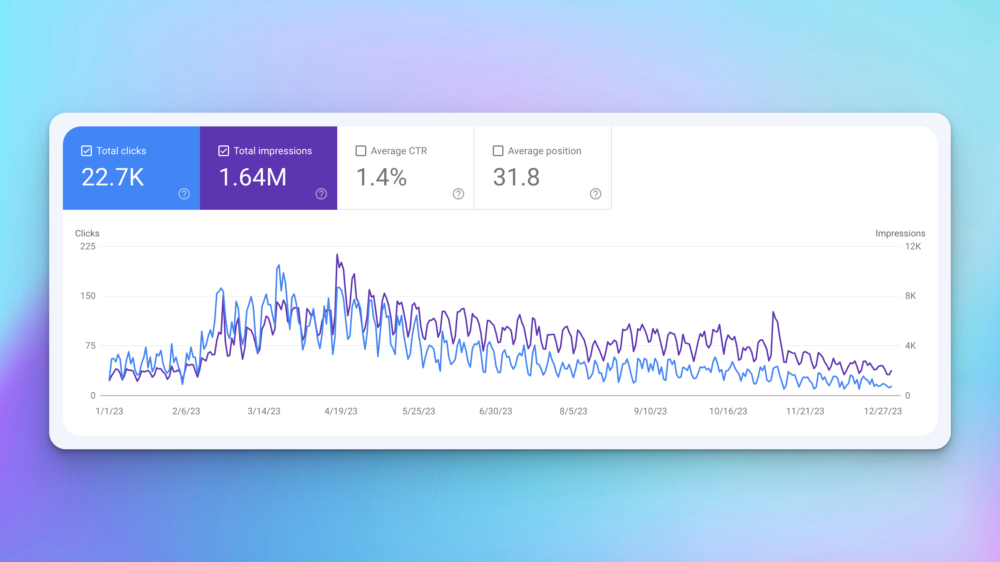

import HighlightedTitle from '../../components/HighlightedTitle';

# <HighlightedTitle text={"Features"} size='text-3xl' />

## See if it sticks

I've been doing a lot of thinking around what I want to build, what I enjoy, what I want to spend my free time hacking on, etc.

As I've been working on my side project, [pairprogram.com](https://pairprogram.com?ref=journal) it's been fun to build, and a great learning experience.

It has a shitload of cool features and functionality.

I've built things like:
- real-time chat
- real-time status notifications
- feed functionality with real-time updates
- platform event broadcasting ("this user logged in", "that user created a post", etc.)
- ability to create and edit complex items, such as `task`s and `project`s
- complex, dynamic email notifications
- role-based access control
- refresh token functionality
- real-time reactions/likes
- robust data fetching, caching, and de-duping mechanism via graphql data loaders
- file uploads
- robust tagging system that personalizes the user experience
- various ways to capture user feedback
- video session and screen share integrations
- webhook consumers
- various scheduled jobs

...and honestly a lot more that I've probably forgotten.

With all these features, you'd think I probably had a damn good reason to build them all, maybe because my users were begging me for these things.

Well -- at least one user was.

Me. Lol.

I've essentially built all of these features because they were cool as hell to implement and I thought they'd be great to add to the platform.

> Build it, and they will come
> - Someone who was lying

But what I've found is that, although I've built some cool ass features -- no one really cares 😂.

Frankly, I haven't built anything that users actually want.

## Try, try, and try again
Originally [pairprogram.com](https://pairprogram.com?ref=journal) started out as a platform solely for people to post some project or issue they'd want to pair on with someone else with, over video chat.

There was a heavy emphasis on video, and understandably so. That's basically how you pair program in a remote world.

After I was getting a little traction, there was still friction in getting people synced up and actually pairing together. People would flake, people couldn't find a time that worked for both parties (even with a Cal.com integration).

So I pivoted again to something adjacent.

Bounties.

Instead, people would be able to post bounties for problems or tasks they wanted others to help them with. It's similar to creating a "post", but there's a bit of nuance between a post and a bounty. A bounty implies a payment is due.

Regardless, this approach also fell flat.

Around this time, it around August 2023. I decided to take a break from the project.

I didn't have any particular timeframe in mind, but I ended up putting it on pause for about 2 months or so.

I hardly thought about the project at all during that time.

It was actually nice to step away and just to collect my thoughts after I'd gone all in on building it since the start of 2023, more or less.

## Making an impression

One day, during my little sabbatical, I had been clicking through my Google Search Console and I had noticed that my blog, [codesnippet.io](https://codesnippet.io?ref=journal) had over 1.5M search impressions over the past year!

Not bad considering a majority of the traffic was coming from 3 posts!

All of which are small, project-based posts:

1. [GitHub API Tutorial](https://codesnippet.io/github-api-tutorial?ref=journal)
2. [Wikipedia API Tutorial](https://codesnippet.io/wikipedia-api-tutorial?ref=journal)
3. [OpenAI Chat API Tutorial](https://codesnippet.io/openai-chat-api-tutorial?ref=journal)

## A-Ha!
It occurred to me that I should lean into these posts.

A lot more.

These project-based posts suit me really well.

I get to hack on something new, build a cool little project, and then share it to the world, and in-turn, others can then share their rendition of my project to the world as well.

Pretty cool.

But where would this leave [pairprogram.com](https://pairprogram.com?ref=journal)?

It wouldn't make sense to share these projects on there because the site was geared towards pair programming

Unless...

## Building together
Pair programming, by definition, is programming that is done together.

If I reworked [pairprogram.com](https://pairprogram.com?ref=journal) to be more of a build-in-public style of platform, where people could share what they're working on with the community, get feedback, kudos, etc. then all of a sudden it would now make sense for me to share the [codesnippet.io](https://codesnippet.io?ref=journal) posts on pairprogram.

I loved this idea.

So I did just that. I reworked the platform.

Not much needed to be added in terms of functionality, it was mostly UI changes.

## Wait and see

It's too early to say whether people "want" the functionality that pairprogram offers now that it's changed to be more of a social, community type of platform, but I'm excited to see where this new rendition goes.

What I will say, though, is that in the meantime I've decided to start up a new hackathon for indie hackers, called the...drum roll please...🥁

## Indie Hackathon!
The first hackathon is slated for February 1st, 2024.

Each participant will have 4 weeks to build a product, ship it, get customer feedback, and iterate until they earn their first dollar.

It's funny because although this hackathon isn't a product per se, I can immediately feel the difference in friction with this compared to pairprogram.

So many people have already mentioned how good of an idea it was, how excited they were, etc.

Overall, this hackathon, and indie hacking in general, suits me really well, so I'm excited to be a lot more involved in the community.

The instant traction with this hackathon, contrasted by the minimal traction of pairprogram reminds me of this quote from Pieter Levels' __MAKE__ book:

> You shouldn't work on an idea that isn't taking off. You can't just for months and years upon years work on something that doesn't give any feedback. It is important that you at least get people excited about your app or your idea and people using it. If nobody's using it, then you're going to lose motivation. For me, the motivation is intrinsic if people use it or if I make money with it. Then I know it works and I want to keep working on it.

I definitely relate to this quote. It's tough to slog through many different iterations of pairprogram.com without anything seeming to hit.

I can't say I'm done with pairprogram, I've flipped back and forth on this for a while now though.

At times it feels like trying to fit a square peg into a round hole.

But maybe, just maybe, pairprogram was meant to lead me to Indie Hackathon all along.

## Come join us

If you're reading this before the inaugural Indie Hackathon, come join us!

👉 [IndieHackathon.com](https://indiehackathon.com?ref=journal)

