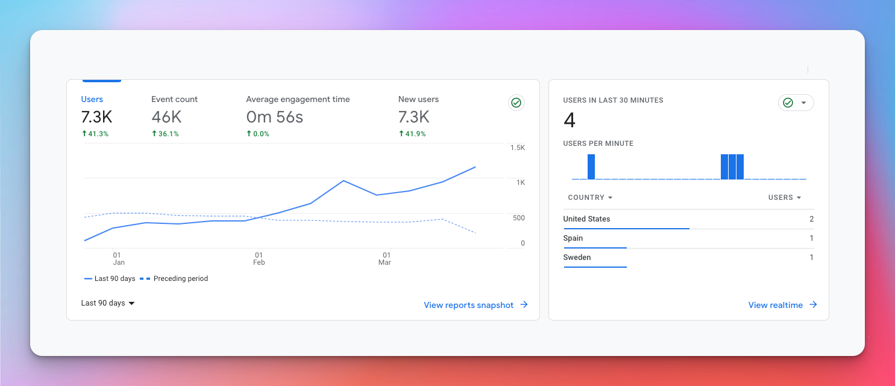
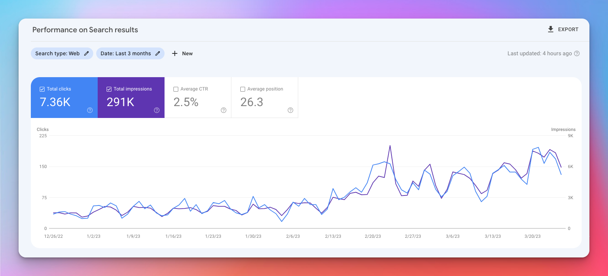
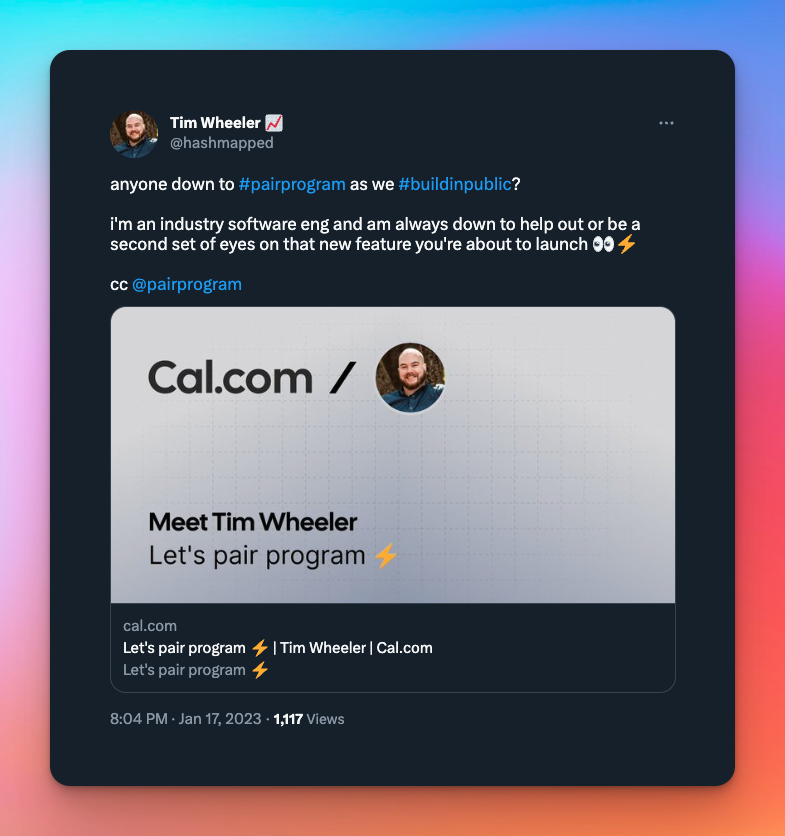

import HighlightedTitle from '../../components/HighlightedTitle';

# <HighlightedTitle text={"Ideation"} size='text-3xl' />

Oh I've been ideating alright...

## Ideas are ~~cheap~~ $9.98

If there's one thing I've learned over the years, it's that there's a lot of truth to the saying "ideas are cheap".

I've been in to domain name investing for a number of years now.
The reason I got into domains in the first place was because I had lots of ideas that I wanted to build.

When I think of a project idea I'll almost immediately search for a cool domain for that potential project, which is probably a backwards way of doing things, but we'll save that for another day lol.

Over time my portfolio has grown, and now I carry around ~300 domains in my portfolio at any given time.

**So as it turns out, for me, ideas are usually around $9.98 a piece** 😅.

I'm sick of having ideas though, give me some execution and follow-through instead.

## Mastermindin' my own business
In early January, right around the time I published my [last post](/posts/intention), I was talking with one of my best friends, [Ali Jobe](https://alijobe.com?ref=journal.timwheeler.com),
telling him about some of the ideas I had in mind to hit my goal of $1k MRR this year. Meanwhile he was also starting to do some cool shit as well, starting to get his podcast, [Upward & Onward](https://upwardandonward.fm?ref=journal.timwheeler.com) 📈, off the ground.

Knowing my own history of having all these "great" ideas backed by fleeting intentions, I asked him if he'd be down to meet once a week just to hold each other accountable on the shit we're doing because this time I wanted things to be different -- I'll be damned if I'm not more **intentional** this year.
Since we're both software engineers we'd run this meeting like a daily standup, except we'd do it weekly. Something like "What did you work on this past week? What are you working on this coming week? Anything else you'd like to share or want feedback on?".

Pretty simple stuff.

Our first meeting was great, and helped us get the ball rolling. I think by the second or third meeting I had invited another great friend of mine, [Rigo Guillen](https://twitter.com/rigoguillen), who is already an entrepreneur running a [moving business](https://www.localtrucks.com?ref=journal.timwheeler.com) in Southern California. It didn't take much convincing to get Rigo to join. He & I are quite similar -- both of us have tons of domains for projects we'd like to build but rarely have we seen any of the projects through.

At this point, our **mastermind** group is 3 people strong. Lots of gold coming from the different perspectives and life experiences sitting at the Google Meet table and we're making sure to hold each other accountable, busting each other's balls if we don't do the tasks we said we were gunna do for that week.

Fast-forward to around the end of February, I invited another heavy-hitter and great friend, [Emiton Alves](https://emiton.io?ref=journal.timwheeler.com), who has experience as a FAANG engineer, was the one who got my into rental property investing, and is currently on a sabbatical doing a ton of random cool shit.

So far we've met weekly for the last 9 weeks or so, and it's been great to hear the advice we give each other and watch as we don't follow our own advice that we give to others week after week 😅.

Funny how that works.

But in all honesty, that's the best part about meeting with these guys. We know the things we _should_ be doing, but if no one is holding us to it, then it's easy to let things slip, or put them off 'til next week.

For me, I have zero issue building a whole web app in a weekend. That's my shit. I love coding.

My weakness is in marketing, talking to customers, getting feedback, that whole side of things. That's exactly why I need to be pushed to do that stuff. At least until I've seen things through on my own so I know how it's done and what that process looks like.

## Isn't it ironic, dontcha think?
In my last post about ["Intention"](/posts/intention), I set a goal of reaching $1k MRR by the end of 2023.

Since then, I've been ideating quite a bit. I've also been hooked on a podcast called [My First Million](https://www.mfmpod.com?ref=journal.timwheeler.com) which has really gotten my creative juices flowing. Both of the hosts have created successful newsletters and sold them for millions.
So I started wondering what was stopping me from doing the same. I already have this blog that gets decent traffic, maybe I can turn it into something.

I realized that two of my posts brought in 80% of my traffic (Pareto principle, where you at?), and they both share a common thread -- they're tutorials on how to build a cool little project with a popular API ([GitHub's API](https://codesnippet.io/github-api-tutorial?ref=journal) & [Wikipedia's API](https://codesnippet.io/wikipedia-api-tutorial?ref=journal)).

So I started thinking, "Okay -- there's an endless sea of APIs that I can build projects with, it'd be cool to hack on tons of little projects, and people seem to like the ones I've put out there, so why not see if I have something here?".

As far as ideation goes, that's where I initially landed, which was sometime around mid-January earlier this year.

Which is also ironic because in [my last post](/posts/intention) I mentioned how I hadn't posted anything on that blog for years
due to imposter syndrome (which was primarily a bunch of bullshit anyway, but I digress), so it's funny how that's where I landed.

## So you wanna build-a-bot?
In a similar format to my other most popular posts on [CodeSnippet.io](https://codesnippet.io?ref=journal.timwheeler.com), I figured I'd start coming up with some ideas of mini projects I could create, and them dissect them one line of code at a time in a blog post that readers could easily follow.

Given the fact that ChatGPT has taken the world by storm, I figured it'd be great to start with a simple chatbot project using OpenAI's APIs (essentially a ChatGPT clone) in my [OpenAI Chat API Tutorial](https://codesnippet.io/openai-chat-api-tutorial?ref=journal.timwheeler.com).

Since I published that post, it's been cool to watch the traffic and subscriber count of my blog grow.

#### CodeSnippet.io Google Analytics as of 03/26/2023

#### CodeSnippet.io Google Search Console as of 03/26/2023

## Writing is a lot of work
Well, not always. But that way these technical blog posts work -- I need to come up with an API to build with, come up with a project to actually build, build it, then write about it step-by-step.
Not complaining, that's just what the process looks like.

This particular post probably took a solid 20-30 hours of work over the course of a couple weeks. Not because the project was complex, but because I spent a lot of time getting the [project template](https://github.com/CodeSnippetHQ/project-template) in place so that subsequent tutorial posts would be faster,
spent a good amount of time updating and customizing my blog theme, and just other random odds and ends that took up a good amount of time.

So realistically, this "post" maybe took about 10 hours, and the rest of the groundwork to make these types of posts "scalable" took a lot of time.

Either way, I was starting to get shiny-object syndrome again, and my focus was veering off towards another half-baked project of mine [pairprogram.com](https://pairprogram.com?ref=journal.timwheeler.com) which is aimed at connect developers to solve problems together.

I was thinking my blog could serve as the funnel to PairProgram.com, and that I should just dive right in to building it.

## Same shit, different project
Not only was I falling back into the same ol' trap I always did of getting bored of something quickly. But I was also just starting to write code for another project that I just assumed people wanted. "A solution in search of a problem" as they say.

Granted, I attribute a lot of the success I've had thus far in my career to pair programming, and that's where my initial idea came from, I still was doing the same shit I had always done. Zero customer research.

## Pivot
So at this point, I have officially pivoted from my idea of building project-based tutorials on my blog to building a platform where people can connect to pair program together.

I made this pivot largely because I tweeted about pair programming with others who were building in public. Sure enough, someone took me up on it, and it was an awesome experience. We both learned a lot, and I was able to hack on a cool project a ship a new feature.

I figured I needed to go all in on this pair programming platform (say that 5 times fast).

## "I don't trust engineers, they just want to build"
That quote by my buddy [Emiton](https://emiton.io?ref=journal.timwheeler.com) from one of our mastermind meetups really stuck with me. It's ironic because he's an engineer too, but maybe that's why it hit so hard.

I realized I was just building this pair programming platform simply because I _could_, and not because I _should_. My first inclination was to _build_.

I hadn't done any of things things I should've been doing to validate my idea. But this is nothing new for me.

After chatting with the guys at our mastermind one night, they encouraged me to stop overthinking shit and just reach out to people on Twitter who I think would be the target audience for this project.

As one of my goals for the week, I decided I needed to reach out to 10 people who have open-sourced some cool projects, and so I created a basic TypeForm with a few questions and DM'd all the people I wanted to chat with. I think 4 of them got back to me.

Based on the responses, I realized my survey questions were akin to "leading the witness" and didn't really give me any valuable insight at all -- mostly just people telling me what they probably thought I wanted to hear.

This had me questioning everything all over again.

"Why am I building this project?"

"I don't even know who the 'customer' of this platform is?"

"How will I monetize this?"

Constantly just second-guessing this whole platform, getting crapped out, and feeling aimless.

## I stream, you stream
A few weeks later, we were having our next mastermind, and my tasks that I was supposed to have completed for PairProgram.com didn't get completed, so I had to pay up on my bounties.

I decided I was going to tell the guys that I'm no longer working on PairProgram.com and that I'm pivoting -- again. To what? I didn't know yet, but I was gunna keep searching. And so I did tell them that.

What ended up happening, was that I got a ton of great advice and this stirred up great conversation overall. Ali kept asking me what the main problem I was trying to solve with PairProgram was and I told him that:

"I want to connect aspiring developers with real-world software engineers so that I can help them overcome the steep learning curve they face when they're just starting out."

I also mentioned how when I first started getting into programming, one of those "lightbulb" moments for me where things really clicked was when I was partnered up with a peer of mine in the coding bootcamp I went to,
and we both had no idea how to code, but we were able to solve the problem together. That was my first taste of pair programming and I'll never forget how powerful it was.

At the end of the day, it was clear that I needed to find out who my ideal customer is for this platform. Aspiring developers -- yes. But also aspiring developers who would like to collaborate with others and aren't too shy to put themselves out there at the very beginning.

So through all of this -- and I think [Rigo](https://twitter.com/rigoguillen) was the one who had said it -- I realized that I needed to become my own first, ideal customer of this pair programming platform.

And so what did that look like? Well, I guess the only way to find out was for me to start trying different shit.
So I landed on -- almost coming full circle -- that I should just live stream myself building these projects that I've created for my [blog](https://codesnippet.io?ref=journal). Through doing so, I will slowly (and hopefully) gain an audience that is interested in what I'm building, and in turn, I can connect with people who enjoy collaborating and building things together.

It turns out, these would likely be the ideal people for this pair programming platform.

Wow! Funny how things work.

Checkout my first two streams on Twitch here:
- [Build a ChatGPT Clone Using the OpenAI Chat API](https://www.youtube.com/watch?v=FALcL45RXYA) (~3hrs )
- [Build a DALL-E Clone Using the OpenAI Image API](https://www.twitch.tv/videos/1776408089) (~2hrs)

## The Q1-2 punch
Q1 is coming to a close, and we're heading into Q2 2023.

I'm still at $0 MRR (_cringe_) but the only direction from here is up.

So while the final chapter of this saga has yet to be written, I'm feeling better about it now than when I first started. I'm truly looking forward to what Q2 has in store -- not only for me but for my homies in the mastermind group.

Here's to pivoting another few more times on **Journey to $1k MRR™** 🍻.

